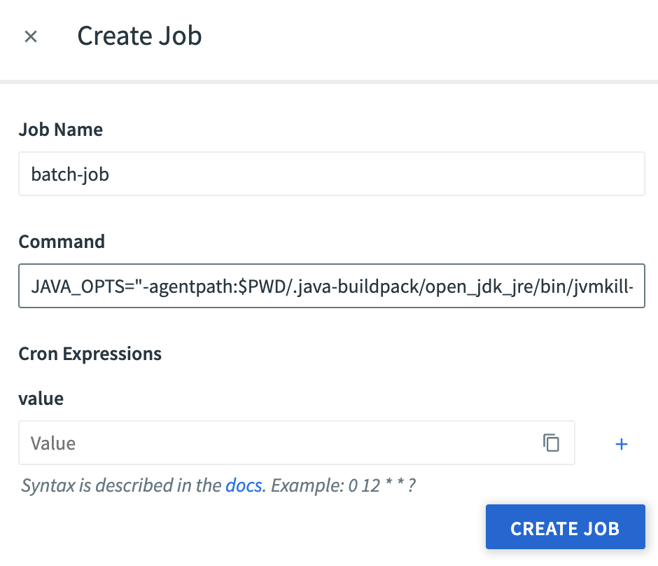
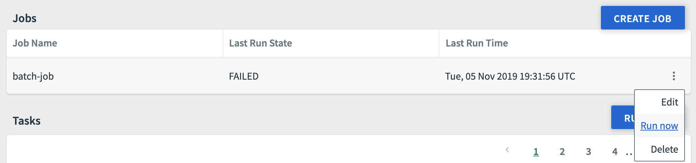
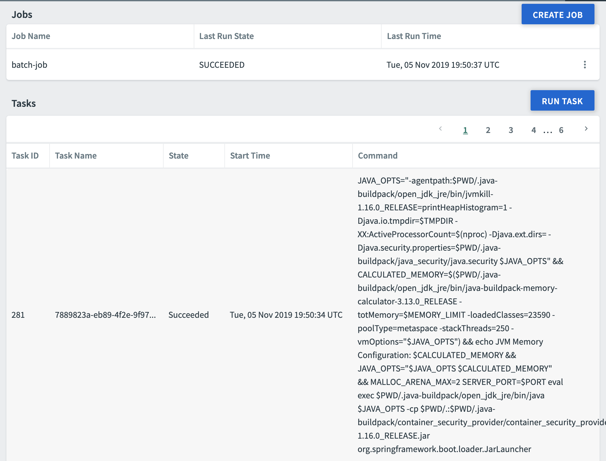
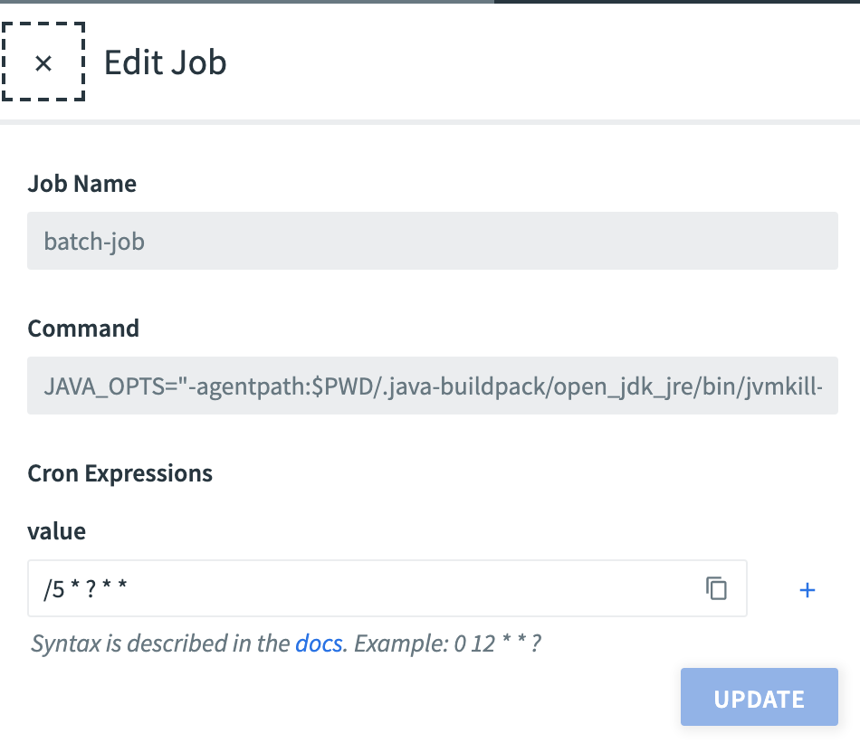

# Scheduling jobs with Pivotal Platform

This project shows how to schedule jobs on
[Pivotal Platform](https://pivotal.io/platform).

Job scheduling relies on
[Cloud Foundry tasks](https://docs.cloudfoundry.org/devguide/using-tasks.html),
a feature supported by Pivotal Platform.
A task is a process running in a container instance. Using
[Pivotal Scheduler service](https://network.pivotal.io/products/p-scheduler-for-pcf)
you can schedule task execution using a `cron` expression.

## How to use it?

This demo defines a simple batch job implemented in Java. This batch job may
eventually use a database to store arbitrary data. In fact, a batch job is no
more different than a regular app running on Pivotal Platform: you can bind any
service and use it in a batch job.

 Compile this app using a JDK 11+:
 ```bash
 $ ./mvnw clean package
 ```

Make sure you have a Pivotal Scheduler service instance in your space:
```bash
$ cf create-service scheduler-for-pcf free scheduler
```

You also need to
[install the Pivotal Scheduler CLI plugin](https://docs.pivotal.io/scheduler/using.html#prereqs).

You are now ready to deploy this app to your Pivotal Platform installation:
```bash
$ cf push
```

This app only contains a batch job: note there is no route attached,
and no instance running.

## Scheduling batch jobs

When a batch job is started, a process defined by its command line is actually running
in the container app. In this demo app, we just want to run this app using
the command line generated by the Java Buildpack,
which also defines optimal memory options. You are free to any command for your batch
job, provided the process you run is available in the container app.

Get the app command line at the end of the command `cf push`:
```bash
$ cf app pcf-scheduler-demo
...
type:            task
instances:       0/0
memory usage:    1024M
start command:   JAVA_OPTS="-agentpath:$PWD/.java-buildpack/open_jdk_jre/bin/jvmkill-1.16.0_RELEASE=printHeapHistogram=1 -Djava.io.tmpdir=$TMPDIR
                 -XX:ActiveProcessorCount=$(nproc) -Djava.ext.dirs= -Djava.security.properties=$PWD/.java-buildpack/java_security/java.security $JAVA_OPTS" &&
                 CALCULATED_MEMORY=$($PWD/.java-buildpack/open_jdk_jre/bin/java-buildpack-memory-calculator-3.13.0_RELEASE -totMemory=$MEMORY_LIMIT -loadedClasses=23590
                 -poolType=metaspace -stackThreads=250 -vmOptions="$JAVA_OPTS") && echo JVM Memory Configuration: $CALCULATED_MEMORY && JAVA_OPTS="$JAVA_OPTS $CALCULATED_MEMORY"
                 && MALLOC_ARENA_MAX=2 SERVER_PORT=$PORT eval exec $PWD/.java-buildpack/open_jdk_jre/bin/java $JAVA_OPTS -cp
                 $PWD/.:$PWD/.java-buildpack/container_security_provider/container_security_provider-1.16.0_RELEASE.jar org.springframework.boot.loader.JarLauncher
```

Create a job:
```bash
$ cf create-job pcf-scheduler-demo batch-job "<app command line>"
```

This action is also available in the UI:



At this point, you can check the command line is working by running the batch job:
```bash
$ cf run-job batch-job
```



Check the batch job is running fine by looking at the app logs.

You can also look at the job history:
```bash
$ cf job-history pcf-scheduler-demo
Getting scheduled job history for batch-job in org Foo / space Bar as johndoe@pivotal.io
1 - 1 of 1 Total Results
Execution GUID                         Execution State   Scheduled Time                  Execution Start Time            Execution End Time              Exit Message
f339215b-40f8-441c-b771-93b553684e8c   SUCCEEDED         Tue, 05 Nov 2019 19:50:37 UTC   Tue, 05 Nov 2019 19:50:37 UTC   Tue, 05 Nov 2019 19:50:37 UTC   202 - Cloud Controller Accepted Task
```



Let's schedule this batch job:
```bash
$ cf schedule-job batch-job "/5 * ? * *"
```



In this example, the batch job will automatically run every 5 minutes,
as defined by the `cron` expression.

## Contribute

Contributions are always welcome!

Feel free to open issues & send PR.

## License

Copyright &copy; 2019 [Pivotal Software, Inc](https://pivotal.io).

This project is licensed under the [Apache Software License version 2.0](https://www.apache.org/licenses/LICENSE-2.0).
